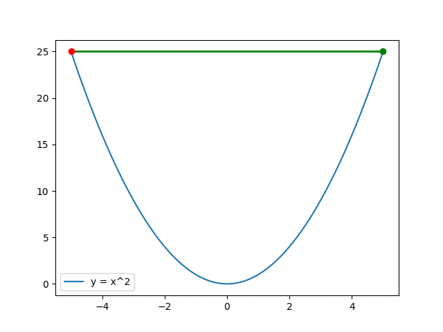
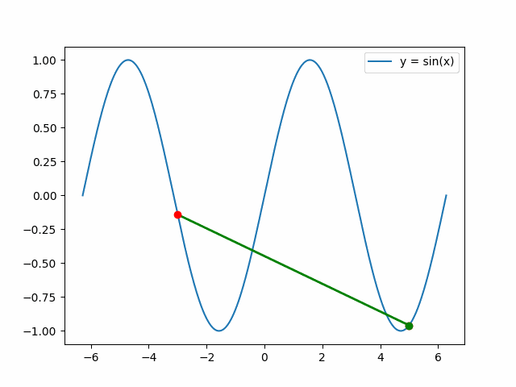

# Hyperelastic Anisotropic Material Neural Network Model

## Introduction
This repository contains the implementation of a neural network model designed to analyze the stress-strain data of hyperelastic, transverse anisotropic materials. The model integrates physical constraints derived from the principles of continuum mechanics, offering a sophisticated approach to understanding material behavior under various conditions.

## Variables and Mathematical Formulations
The model utilizes several key variables and mathematical formulations to accurately represent the material's response to stress and strain:

- **F:** Deformation Gradient
- **C:** Right Cauchy Tensor
- **b:** Left Cauchy Tensor

### Mathematical Expressions
The following equations are central to the model's calculations, defining the relationships between the deformation gradient, Cauchy tensors, and the non-distortional parts of the material's response:

- Deformation Gradient Adjustments:
  - $\bar{\mathbf{F}} = J^{-\frac{1}{3}} \mathbf{F}$
  - $\bar{\mathbf{b}} = J^{-\frac{2}{3}} \mathbf{b}$
  - $\bar{\mathbf{C}} = J^{-\frac{2}{3}} \mathbf{C}$

- Stress Calculations:
  - Cauchy Stress Calculation and Invariance Calculations are detailed within the repository, focusing on the derivation and computational implementation of these critical measures.
  - 
  - where , , and 
  - where 
  - where 

### Non-Distortional Parts and Invariance Calculations
- The repository further explores the non-distortional components of deformation and their influence on material behavior, alongside comprehensive invariance calculations to support model accuracy.

### ICNN
)

### Convexity



## Results
The implementation yields detailed stress analyses for various conditions, illustrated through stress diagrams:


## Project Details
Further insights into the project, including methodology, data analysis, and findings, are available in the accompanying PowerPoint presentation:

[Project Presentation](ppt/presentation_submition.pptx)

## Getting Started

### Prerequisites
Ensure you have Git installed to clone the repository and Python 3.x for running the code.

### Installation and Execution
1. Clone the repository:
   ```bash
   git clone https://github.com/Tanzeela-dev/hyperelastic-anisotropic-nn
   ```

2. Install the required dependencies:
   ```bash
   pip install -r requirements.txt
   ```

3. Data Overview:
   - Stress and strain data is stored in `avgStrainStressInfoNEPureShearLoading.csv`, with the first six columns denoting nominal strains in `11, 22, 33, 12, 13, 23` directions, followed by stress data in the same sequence.

4. Running the Code:
   - Execute `ICNN_implementation.ipynb` and `HyperParameterTuning_new.ipynb` using Jupyter Notebook or Visual Studio Code to explore the neural network model and hyperparameter tuning processes.

## Acknowledgements
The data utilized in this study is derived from [Jamal's thesis](https://jamal-dev.github.io/about/), providing a foundational basis for the model's development and analysis.
